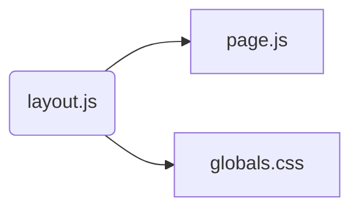
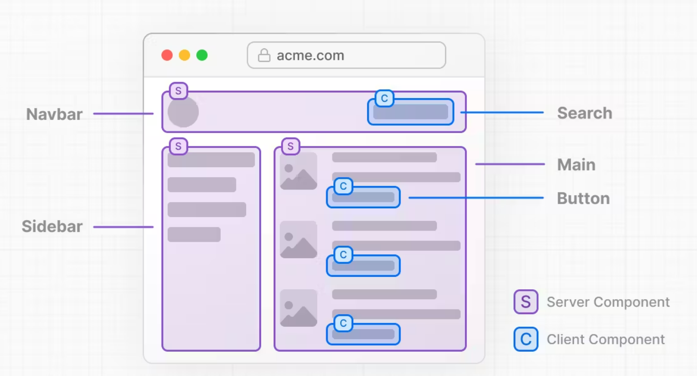

### 기본구조

---

### 첫 시작
- node.js 기반 project는 package.json에 scripts 존재
- dev 개발 서버
- build 실서버용 배포판
- start 배포판 서비스
- dev -> build 용량 차이 어마어마어마어마
---

### ROUTING
- http://a.com/dashboard/analytics/
- a.com : domain
- dashboard : segment
- analytics : segment
- dashboard/analytics/ : path

- routing 방식
  - create file -> app folder 하위 create folder 찾음 -> create folder 하위 page.js
    - -> create folder 하위 layout.js 존재 -> page.js와 결합
    - -> create folder 하위 layout.js 없음 -> create folder 부모(app)한테 가서 layout.js 찾음 -> children 위치에 들어감

  ```mermaid
  stateDiagram-v2
      appFolder --> createFolder

      createFolder --> page.js: layout.js 하위 존재
      createFolder --> app : layout.js 하위 없음
      app --> layout.js
      layout.js --> children
  ```

- server side rendering
  - debug > Run command > disable javascript 해도 보여짐
- single page application
  - Link tag > background 에서 미리 준비, 접속 이력 있는 page 재렌더 안함
---

#### Route Handlers
- nextjs server 구축 가능
---

### backend 구축
> npx json-server --port 9999 --watch db.json
- db.json 정보 저장
- --watch 변경되면 서버 반영

- db.json file 생성
- http://localhost:9999/posts
  ```
  [
    {
      "id": 1,
      "title": "json-server",
      "author": "typicode"
    }
  ]
  ```
- db.json 수정 가능
  http://localhost:9999/topics
  ```
  [
    {
      "id": 1,
      "title": "html",
      "body": "html is ..."
    },
    {
      "id": 2,
      "title": "css",
      "body": "css is ..."
    }
  ]
  ```
- data -> javascript
  - fetch 함수 기본 형태
  ```
  fetch(주소)
  .then(함수)
  .then();
  ```
  ```
  fetch('http://localhost:9999/topics')
  .then((res)=>{
      return res.json();
      // server --data--> json --converting--> javascript
    })
  .then(result => {
      console.log('result', result)
    });
  ```
---

### Component
- Server Component
  - secure data, cookie header
  - 정보 표현, 사용자와 상호작용 안함
- Client Component
  - useState, useEffect, onClick, onChange, useRouter, useParams
  - 사용자와 상호작용 함
- 공통
  - fatch



- server component에서 client component 함수 사용하면 나오는 error
  > "You're importing a component that needs useState. It only works in a Client Component but none of its parents are marked with "use client", so they're Server Components by default."

- Client Component
  ~~~
  export default function RootLayout({
    const [topics, setTopics] = useState<string[]>([]);
    useEffect(() => {
      fetch('http://localhost:9999/topics')
        .then(res => res.json())
        .then(result => {
        setTopics(result);
      });
    },[]);
  ~~~

- Server Component
  ~~~
  export default async function RootLayout({
    const res = await fetch('http://localhost:9999/topics');
    const topics = await res.json();
  ~~~
  - fetch -> await -> .json() -> server(.next 저장) -> javascript
  제외한 정적인 내용 client
  - 용량 절약, server에서 랜더링 후 client에게 보냄

- remove .next file : `rm .next`

- useRouter
~~~
  import { useRouter } from "next/router"; // ver.12 pageRouter방식
  import { useRouter } from "next/navigation"; // appRouter방식
~~~

### Cache
- MISS cache 미사용(새로 만듦), 최초 접속 시 데이터 가져와서 저장
  > GET /topics/8 200 29.838 ms - 63
- HIT cache 사용, reload 해도 통신 안함

- cache 끄기
  - fetching > revalidate
  fetching함수의 option `{ next: { revalidate: 10 }}` : 10초 뒤에 cache 다시 만든다
  fetching함수의 option `{ next: { revalidate: 0 }}` : cache 미사용
  - fetching > no-store
  fetching함수의 option `{ cache: 'no-store' }` : 저장하지 않음


### Revalidationg Data
- todo

### Caching Data
- todo

### client IN server
- component로 따로 파일 빼기
- server component 파일 안에 client component 만들기
